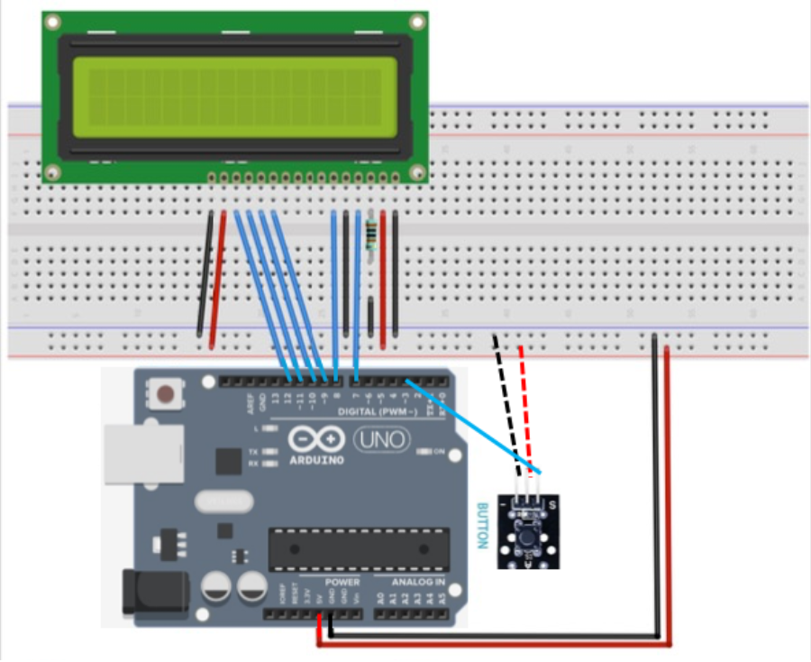
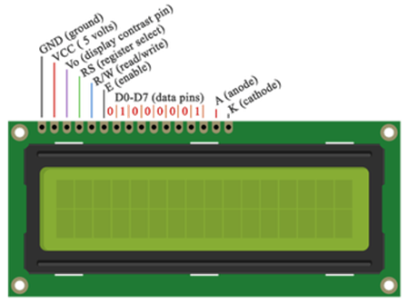

# LCD display project for IoT lab

*Description:*

This is a reaction game implemented using Arduino, a button and an LCD display. After a random delay between 3 to 6 seconds, when the message "Press NOW!" appears on the LCD display, you need to press the button as fast as possible.
Then the amount of time you took to react is displayed on the LCD.

*Hardware Setup:*
1.	Connect the LCD module:

    RS to Digital Pin 7

    EN to Digital Pin 8

    D4 to Digital Pin 9

    D5 to Digital Pin 10
    
    D6 to Digital Pin 11
    
    D7 to Digital Pin 12
    
    VSS to GND
    
    VDD to 5V
    
    VO to 1kOhms resistor to GND
    
    RW to GND
    
    A (Backlight +) to 5V
    
    K (Backlight -) to GND

2.	Connect the RGB LED (Common Cathode):
    
    "S" side to Digital Pin 3
    
    "-" side to GND
    
    Middle pin to 5V

Follow the diagram below for the connection details.
 

LCD Display pinout:
 
